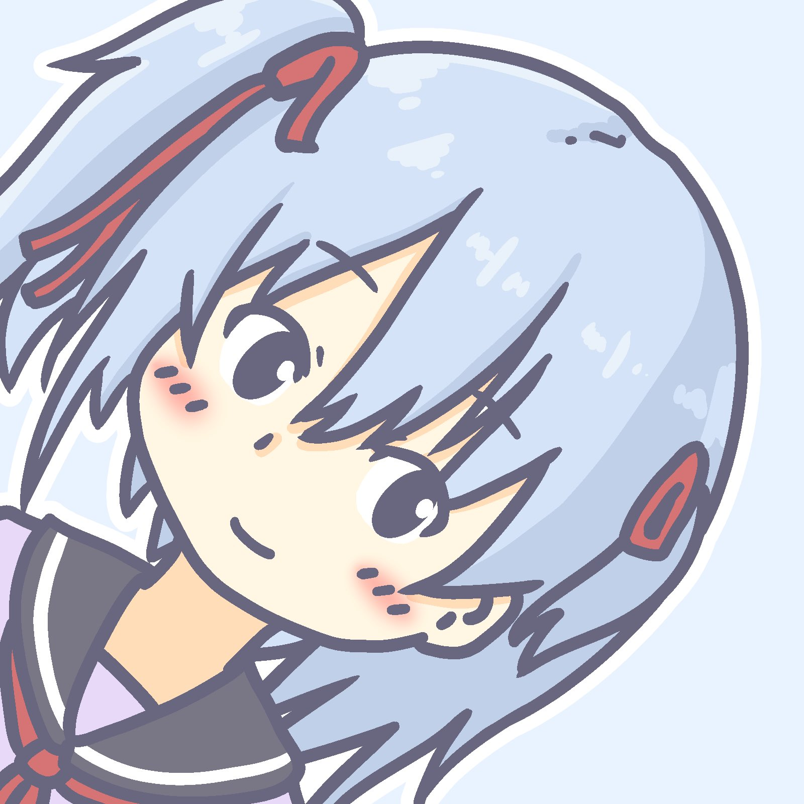
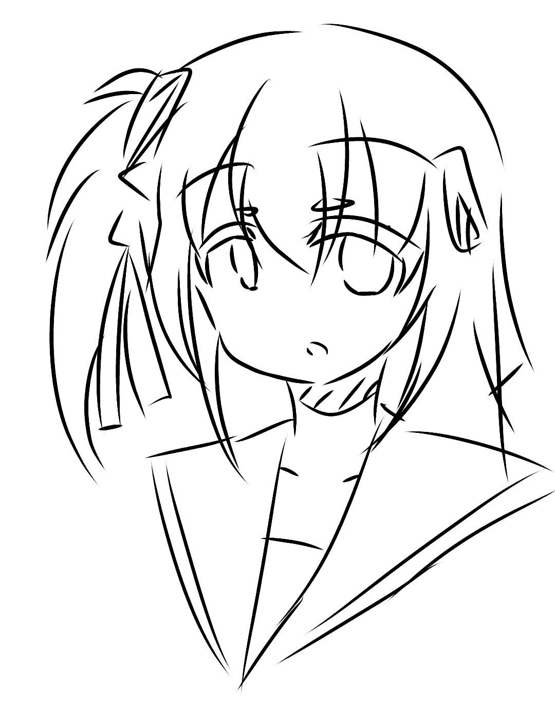
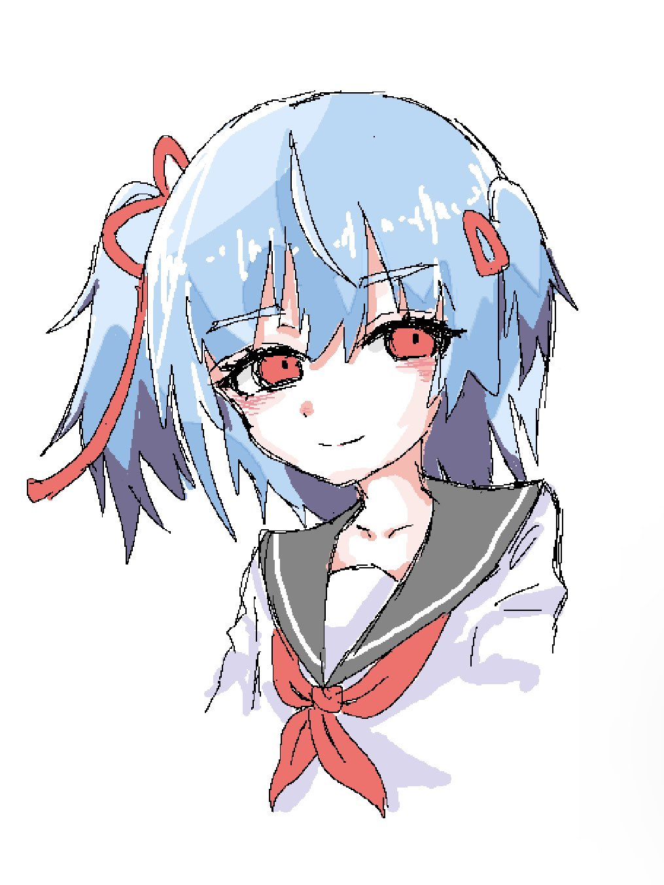
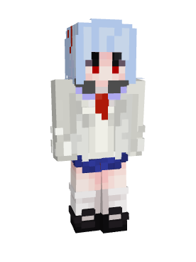
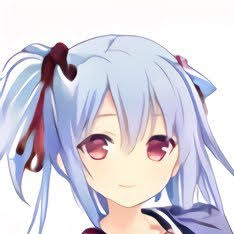

# avatar

## めるアイコン

[第 5 回プランクトンサミット](https://plankton-summit.com/)にて [Melville](https://twitter.com/MelvilleTw) さんに描いていただきました。

本アイコンの著作権は [Melville](https://twitter.com/MelvilleTw) さんに帰属します。

（ちゃんと[めるアイコン Wiki](https://scrapbox.io/meruicon/@Kyure_A#5ea7321210150a00172f36e7)にも index されている）

ありがとうございます！

## く゚ アイコン

[く゚](https://twitter.com/qiwdu) さんに描いていただきました。
本アイコンの著作権は [く゚](https://twitter.com/qiwdu) さんに帰属します。

ありがとうございます！

## unknown アイコン

[unknown](https://twitter.com/PuddingsTheorem) さんに  として描いていただきました。
本アイコンの著作権は [unknown](https://twitter.com/PuddingsTheorem) さんに帰属します。

ありがとうございます！

## Minecraft Skin

## 古いアイコン
 

[MakeGirlsMoe](https://make.girls.moe/)（モデルはなんだったか忘れた）で生成した美少女で，上に示したアイコン群の元ネタです

## [Identicon](https://github.blog/2013-08-14-identicons/)

競技プログラミングとかのクールぶりたい文脈でよく使うアイコンです
